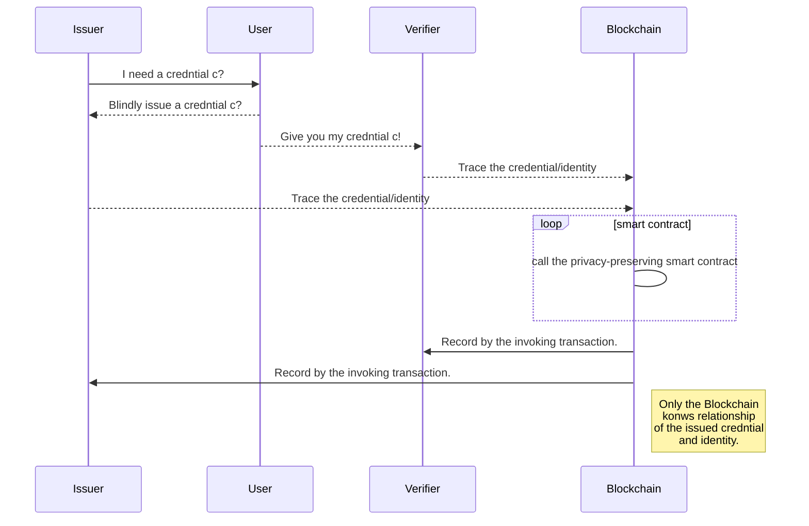

# Auditable-blindCA demo

This demo serves as an example for issuing a credential blindly and tracing the anonymous credential with a powerful auditability. To interact with this example locally follow the steps below.

## How does the project work

### The overview

### Code and Functionality

|                |Code                          |Functionality                         |
|----------------|-------------------------------|-----------------------------|
|Preparation|`contracts/AuditTracer.sol`            | Preparing the parameters.           |
|Issuing          |`auditable-blindCA-issuer`            |Issuing a credential.|
|Verifying|`auditable-blindCA-issuer`|Verifying a credential.|
|Tracing|`contracts/AuditTracer.sol`|Tracing a credential/indetity.|


Issuer or Verifier first builds an end-to-end encrypted channel with privacy-preserving smart contract $\mathcal{PPSC}$. Then, given valid $\xi^{\upsilon}$, the $\mathcal{PPSC}$ computes $I_{cred} = (\xi^{\upsilon})^{x_t}$. Observe that:

$$I_{cred} = (\xi^{\upsilon})^{x_t} = g^{\gamma\upsilon x_t} = y_t^{\gamma\upsilon} = \zeta_1$$

Issuer or Verifier first builds an end-to-end encrypted channel with $\mathcal{PPSC}$ . Then, given a valid credential $(\zeta_1,\rho,{\overline{\omega}},\sigma_1,\sigma_2,\delta)$, the $\mathcal{PSC}$ computes $I_{id} = \zeta_1^{1/x_t}$. Observe that:

$$I_{id} = \zeta_1^{1/x_t} = z_1^{\lambda/x_t} = y_t^{\upsilon\lambda/x_t} = g ^{\upsilon\lambda} = \xi^{\upsilon} $$


## Run the example locally

### Initial setup

* Run `npm install`

### Deploying privacy-preserving smart contract

Privacy-preserving smart contract is in the folder of /contracts

To compile a smart contract, run:

* `truffle compile`

The correct output:
```
Building contracts for Oasis   
   Compiling AuditTracer.sol...    
   Compiling Migrations.sol...    
Writing artifacts to ./build/contracts  
```

Deploy the contract with truffle:

* Edit `truffle.js` to add the mnemonic for your private key. This will be the address that deploys the smart contract;

* `truffle migrate --reset --network oasis`

Note the address of the deployed contract in the output
```
...
Saving artifacts...
Running migration: 2_deploy_contracts.js
  Replacing AuditTracer...
  ... 0x45623111 ...
```

In this example the ballot was deployed to address `0x03D1ee0729188eca4c614f2C123DB63639b2d018`

### Interacting with the local demo

* Launch the local web server: `npm run dev`

The correct output:
```
Project is running at http://localhost:8080/
webpack output is served from /
Hash: 7abdd3295cdaa29f24cb
Version: webpack 2.7.0
Time: 9079ms
                         Asset     Size  Chunks                    Chunk Names
           index_register.html  10.7 kB          [emitted]         
                     .....
  [236] multi (webpack)-dev-server/client?http://localhost:8080 ./app/javascripts/app.js 40 bytes {1} [built]
     + 221 hidden modules
webpack: Compiled successfully.
```


* In your browser visit `127.0.0.1:8080/tracing.html?contractAddress=<address>`

## Reference
[https://docs.oasiscloud.io/en/latest/quickstart-guide/](https://docs.oasiscloud.io/en/latest/quickstart-guide/) 

[https://docs.oasiscloud.io/en/latest/](https://docs.oasiscloud.io/en/latest/)

[https://github.com/oasislabs/secret-ballot](https://github.com/oasislabs/secret-ballot)